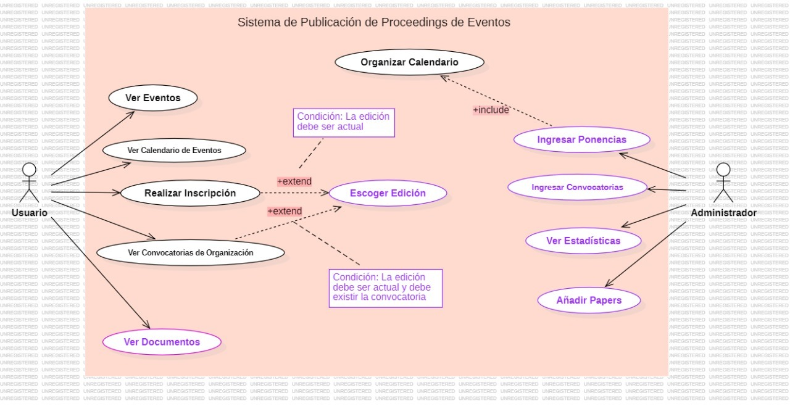
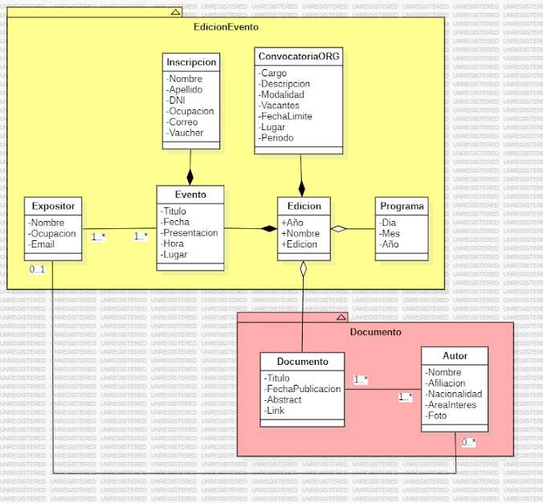
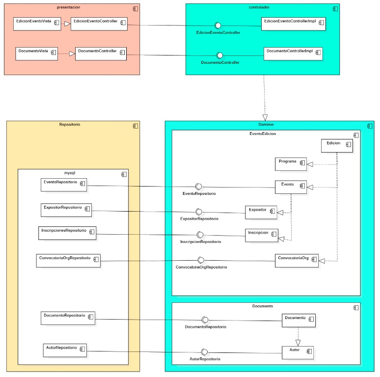
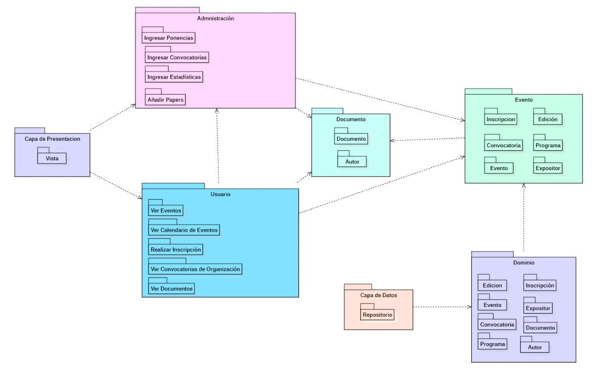
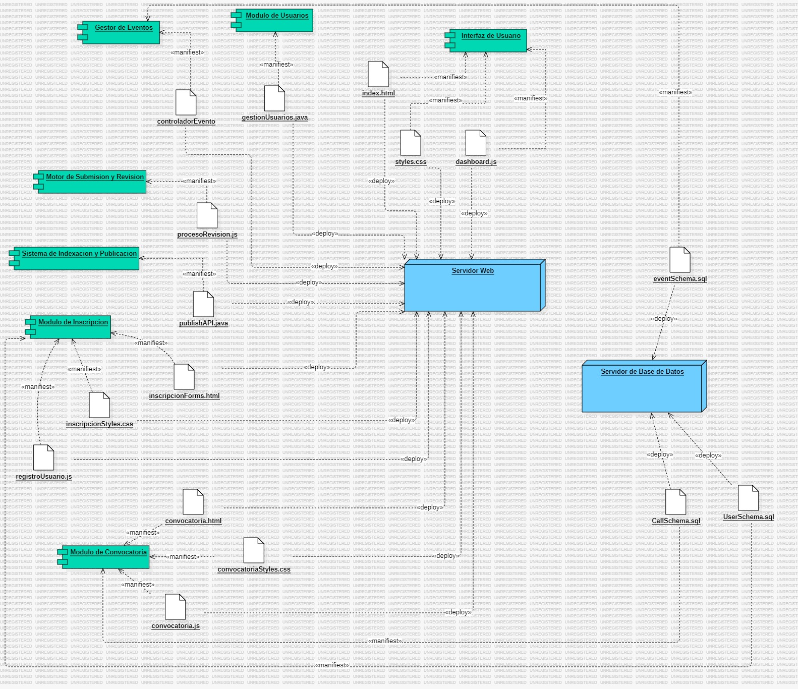
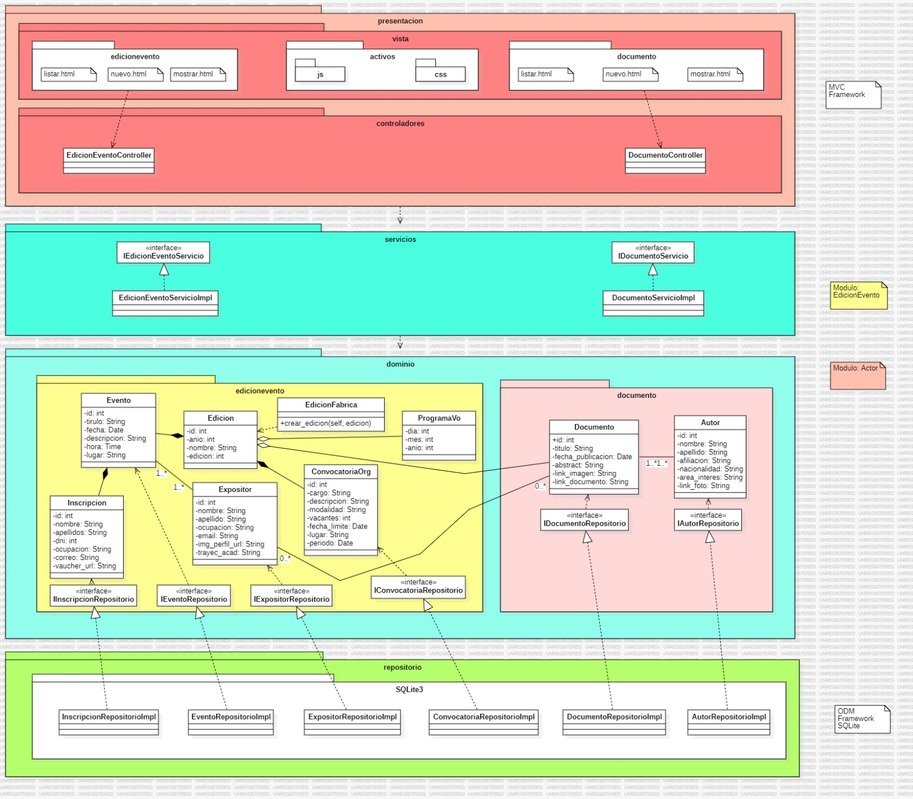

#### 1. Propósito del Proyecto
El propósito de este proyecto es desarrollar un **Sistema de Publicación de Proceedings de Eventos**. Este sistema permite gestionar la organización de eventos académicos, incluyendo la gestión de artículos, autores, ediciones, convocatorias y programas. Facilita a los usuarios subir artículos, gestionar la información de los eventos, y proporciona una plataforma para la inscripción y participación en dichos eventos.

#### 2. Funcionalidades
#### Diagrama de casos de uso 

- **Funcionalidades de Alto Nivel**:
  - **Gestión de Eventos**: Creación y configuración de eventos, gestión de fechas importantes y temas de interés.
  - **Gestión de Artículos**: Subida de artículos, revisión por pares (autor-documento).
  - **Gestión de Convocatorias**: Creación y administración de convocatorias de artículos.
  - **Inscripciones**: Gestión de inscripciones para eventos y expositores.

#### 3. Modelo de Dominio
#### Diagrama de Clases y Módulos




  - Describe las entidades principales del sistema como `Evento`, `Autor`, `Documento`, `Edición`, `ConvocatoriaOrg`, entre otras, y sus relaciones.

#### 4. Arquitectura y Patrones
#### Diagrama de Componentes o Paquetes

  - Describe la arquitectura del sistema, incluyendo la separación en capas y los módulos de cada capa.

### 5. Prácticas de Codificación Limpia Aplicadas

**a. Nombres Descriptivos**

El uso de nombres claros y descriptivos para funciones, clases y variables mejora la legibilidad y mantenibilidad del código.

```python
def obtener_evento(id: int) -> Evento:
    """Obtiene un evento por su ID."""
    evento_modelo = EventoModelo.query.get(id)
    if evento_modelo:
        return Evento(
            id=evento_modelo.id,
            nombre=evento_modelo.nombre,
            fecha=evento_modelo.fecha,
            descripcion=evento_modelo.descripcion,
            hora=evento_modelo.hora,
            lugar=evento_modelo.lugar,
            edicion_id=evento_modelo.edicion_id
        )
```

**b. Separación de Concerns**

El código se organiza de manera que las diferentes preocupaciones estén separadas, como la lógica de negocio y el acceso a datos.

```python
class DocumentoServicioImpl:
    def __init__(self, documento_repo: DocumentoRepositorio):
        self.documento_repo = documento_repo

    def crear_documento(self, documento: Documento):
        """Crea un nuevo documento."""
        self.documento_repo.crear(documento)
```

**c. Código Reutilizable**

Uso de funciones auxiliares y servicios para encapsular la lógica común, lo que facilita la reutilización y reduce la duplicación de código.

```python
def parse_fecha(fecha_str: str) -> Optional[datetime]:
    try:
        return datetime.fromisoformat(fecha_str)
    except ValueError as e:
        print(f"Error al parsear la fecha: {e}")
        return None
```


**d. Funciones Pequeñas y Enfocadas**
Dividir el código en funciones pequeñas que realicen una sola tarea específica. Esto facilita el mantenimiento y la reutilización del código.

**Ejemplo:**
```python
def obtener_documento(id: int) -> Documento:
    """Obtiene un documento por su ID."""
    documento = documento_servicio.obtener_documento(id)
    if documento:
        return documento.to_dict()
    else:
        return None
```

**e. Validación de Entradas**
La validación de entradas asegura que los datos que recibe el sistema sean correctos y esperados, lo cual es crucial para la seguridad y la estabilidad de la aplicación.

**Ejemplo:**
```python
if edicion_id is not None:
    if not edicion_servicio.obtener_edicion(edicion_id):
        return jsonify({"error": "Edición no encontrada."}), 400
```

**f. Modularidad y Separación de Responsabilidades**
Dividir la aplicación en módulos separados con responsabilidades claras mejora la organización del código y facilita su mantenimiento. Por ejemplo, tener diferentes servicios y repositorios para gestionar distintas partes de la aplicación.

**Ejemplo:**
```python
from app.aplicacion.servicios.documento_servicio import DocumentoServicioImpl
from app.infraestructura.repositorio.sqlite3.documento_repositorio_impl import DocumentoRepositorioImpl
# Separación de responsabilidades entre servicios y repositorios
```

Estas prácticas, aplicadas correctamente, contribuyen a la creación de un código más limpio, mantenible y fácil de entender, lo que es esencial para el desarrollo de software de calidad.

Estas prácticas y principios garantizan que el código sea fácil de entender, mantener y escalar.

### 6. Estilos de Programación Aplicados

**a. Cookbook**

En el proyecto, se utiliza un estilo "Cookbook" para manejar funciones auxiliares y utilitarias que se pueden reutilizar en varias partes del código. Este estilo ayuda a mantener el código organizado y modular.

```python
# Funciones auxiliares para convertir fechas y datos de autor
def parse_fecha(fecha_str: str) -> Optional[datetime]:
    try:
        return datetime.fromisoformat(fecha_str)
    except ValueError as e:
        print(f"Error al parsear la fecha: {e}")
        return None

def parse_autor(autor_data: Dict) -> Optional[Autor]:
    if autor_data:
        return Autor(
            id=autor_data.get('id'),
            nombre=autor_data.get('nombre'),
            email=autor_data.get('email'),
            afiliacion=autor_data.get('afiliacion'),
            nacionalidad=autor_data.get('nacionalidad'),
            area_interes=autor_data.get('area_interes'),
            link_foto=autor_data.get('link_foto')
        )
    return None
```

**b. Error/Exception Handling**

El manejo adecuado de errores y excepciones es fundamental para la robustez del sistema. Se captura y maneja las excepciones de manera que el sistema pueda recuperarse o notificar adecuadamente al usuario.

```python
def crear(self, edicion: Edicion):
    """Agrega una nueva edición a la base de datos."""
    try:
        edicion_modelo = EdicionModelo.from_domain(edicion)
        db.session.add(edicion_modelo)
        db.session.commit()
        edicion.id = edicion_modelo.id
    except Exception as e:
        db.session.rollback()
        raise RuntimeError(f"Error al crear la edición: {str(e)}")
```

**c. Pipeline**

El estilo de programación "Pipeline" se usa para construir cadenas de procesamiento de datos donde el resultado de una operación se pasa a la siguiente operación. En este contexto, el pipeline se ve en las operaciones de recuperación y actualización de documentos y autores.

```python
@app.route('/evento', methods=['POST'])
def crear_evento():
    try:
        # 1. Parseo de los datos de la solicitud
        data = request.get_json()
        nombre = data.get('nombre')
        fecha_str = data.get('fecha')
        descripcion = data.get('descripcion')
        hora_str = data.get('hora')
        lugar = data.get('lugar')
        edicion_id = data.get('edicion_id')

        # 2. Conversión de fecha y hora a objetos datetime
        fecha = datetime.strptime(fecha_str, "%Y-%m-%d") if fecha_str else None
        hora = datetime.strptime(hora_str, "%H:%M:%S").time() if hora_str else None

        # 3. Validación de datos adicionales (opcional)
        if edicion_id is not None and not edicion_servicio.obtener_edicion(edicion_id):
            return jsonify({"error": "Edición no encontrada."}), 400
        
        # 4. Creación de la entidad de negocio
        evento = Evento(
            nombre=nombre,
            fecha=fecha,
            descripcion=descripcion,
            hora=hora,
            lugar=lugar,
            edicion_id=edicion_id
        )

        # 5. Llamada al servicio para persistir los datos
        evento_servicio.crear_evento(evento)

        # 6. Respuesta con el recurso creado
        return jsonify(evento.to_dict()), 201
    except Exception as e:
        # 7. Manejo de errores
        return jsonify({"error": f"Error al crear evento: {str(e)}"}), 400
```

En este pipeline:
1. **Parseo de datos**: Se extraen y validan los datos de la solicitud JSON.
2. **Conversión de tipos**: Se convierten las cadenas de fecha y hora en objetos `datetime`.
3. **Validación**: Se verifica la existencia de la edición, si se proporciona un `edicion_id`.
4. **Creación de la entidad**: Se crea un objeto de dominio `Evento` con los datos procesados.
5. **Persistencia**: Se guarda el objeto en la base de datos a través del servicio correspondiente.
6. **Respuesta**: Se devuelve una respuesta HTTP con el recurso creado o con un mensaje de error.

**d. Restful**

Este estilo se basa en la arquitectura REST para exponer servicios web a través de endpoints HTTP. Las rutas se configuran para realizar operaciones CRUD (Crear, Leer, Actualizar, Eliminar) en recursos.

```python
@app.route('/documentos/<int:id>', methods=['GET'])
def obtener_documento(id: int):
    """
    Obtiene un documento por su identificador.

    Args:
        id (int): El identificador del documento.

    Returns:
        Response: Respuesta JSON con el documento, o error si no se encuentra.
    """
    documento = documento_controller.obtener_documento(id)
    if documento:
        return jsonify(documento.to_dict())
    return documento_no_encontrado()
```

**e. Persistent-Tables**

El estilo de programación "Persistent-Tables" se refiere al uso de modelos persistentes en bases de datos para representar entidades del dominio. En este caso, se utilizan modelos de SQLAlchemy para mapear los datos de los autores y documentos en la base de datos.

```python
class AutorModelo(db.Model):
    __tablename__ = 'autores'
    
    id_autor = db.Column(db.Integer, primary_key=True, autoincrement=True)
    nombre = db.Column(db.String(150), nullable=False)
    email = db.Column(db.String(150), nullable=False, unique=True)
    afiliacion = db.Column(db.String(50), nullable=True)
    nacionalidad = db.Column(db.String(50), nullable=False)
    area_interes = db.Column(db.String(50), nullable=False)
    link_foto = db.Column(db.Text, nullable=False)

    def to_dict(self):
        return {
            "id_autor": self.id_autor,
            "nombre": self.nombre,
            "email": self.email,
            "afiliacion": self.afiliacion,
            "nacionalidad": self.nacionalidad,
            "area_interes": self.area_interes,
            "link_foto": self.link_foto
        }

```

### 7. Principios SOLID Aplicados

**a. Single Responsibility Principle (SRP)**

Cada clase y función debe tener una única responsabilidad. Este principio se aplica al separar las responsabilidades en diferentes clases y servicios.

```python
class EdicionRepositorioImpl(EdicionRepositorio):
    """Implementación del repositorio para la entidad Edicion."""
    # Responsabilidad única de manejar operaciones de base de datos de ediciones

class DocumentoServicioImpl:
    """Servicio de negocio para manejar documentos."""
    # Responsabilidad única de manejar lógica de negocio de documentos
```

**b. Open/Closed Principle (OCP)**

El sistema está diseñado para ser extendido sin modificar el código existente, lo que facilita la adición de nuevas funcionalidades.

```python
class DocumentoServicioImpl:
    def __init__(self, documento_repo: DocumentoRepositorio):
        self.documento_repo = documento_repo

    def crear_documento(self, documento: Documento):
        """Crea un nuevo documento."""
        self.documento_repo.crear(documento)
```

**c. Interface Segregation Principle (ISP)**

Las interfaces están diseñadas para ser específicas a un cliente, asegurando que los clientes no se vean obligados a implementar métodos que no usan.

```python
class EventoRepositorio(ABC):
    """Interfaz para el repositorio de Evento. Define métodos CRUD esenciales."""

    @abstractmethod
    def crear(self, evento: Evento):
        pass

    @abstractmethod
    def obtener(self, id: int) -> Evento:
        pass
```


#### 8. Conceptos DDD Aplicados
- **Entidades y Objetos de Valor**: Definición de entidades como `Evento`, `Autor`, y objetos de valor asociados.
- **Agregados y Módulos**: Agrupación lógica de entidades relacionadas.
- **Repositorios**: Implementación de patrones de repositorio para manejar el acceso a datos.

#### 9. Arquitectura en Capas
- **Presentación**: Capas de vistas y controladores para la interacción con el usuario.
- **Aplicación**: Lógica de negocio encapsulada en servicios.
- **Dominio**: Definición de las reglas de negocio y entidades del sistema.
- **Infraestructura**: Manejo de la persistencia de datos y conexión con bases de datos.

---

### Configuración de Rutas (Extracto de `routes.py`)
- **Rutas de Autor**:
  ```python
  @app.route('/autor', methods=['POST'])
  def crear_autor():
      data = request.get_json()
      autor = Autor(
          id=None,
          nombre=data.get('nombre'),
          email=data.get('email'),
          afiliacion=data.get('afiliacion'),
          nacionalidad=data.get('nacionalidad'),
          area_interes=data.get('area_interes'),
          link_foto=data.get('link_foto')
      )
      try:
          autor_servicio.crear_autor(autor)
          return jsonify(autor.to_dict()), 201
      except Exception as e:
          return jsonify({"error": f"Error al crear autor: {str(e)}"}), 400
  ```
